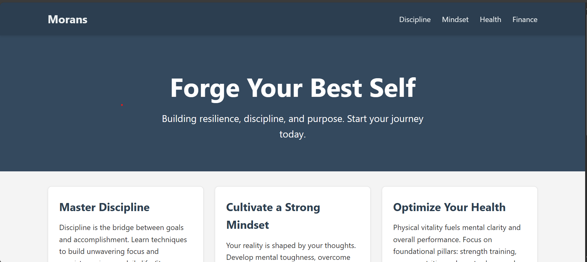

# Men's Improvement Website - Morans (HTML & CSS)

## Project Overview

This project is a simple, static frontend implementation of a conceptual Men's Improvement website, named "Morans". It serves as a demonstration of core web layout techniques using modern CSS (Flexbox and CSS Grid) and responsive design principles. The website is built entirely with HTML5 and CSS3, with a tiny bit of JavaScript solely for updating the copyright year.

The focus is on structure, layout, and adaptability across different screen sizes (mobile, tablet, desktop), rather than complex functionality. Content themes revolve around common self-improvement pillars like discipline, mindset, health, and finance.

**(Screenshot of the website's desktop view here)**
*

## Features

* **Semantic HTML5:** Clean and well-structured markup using appropriate tags (`<header>`, `<nav>`, `<main>`, `<section>`, `<article>`, `<footer>`).
* **Sticky Navigation Bar:** A navigation bar that remains fixed at the top of the viewport during scrolling for easy access to different sections.
* **Hero Section:** An impactful introductory section with a headline and tagline.
* **CSS Grid Layout:** The main content area utilizes CSS Grid to arrange topic cards efficiently.
* **Flexbox Layout:** The navigation bar components (logo and links) are positioned using Flexbox.
* **Responsive Design:** The layout adapts fluidly to various screen sizes using CSS Media Queries, ensuring usability on mobile phones, tablets, and desktops.
* **Smooth Scrolling:** Navigation links point to specific sections (`#id`) on the same page.
* **Basic Styling:** Clean visual presentation with appropriate colors, fonts, spacing, borders, and subtle hover effects.
* **Dynamic Copyright Year:** A minimal JavaScript snippet updates the copyright year in the footer automatically.

## Technologies Used

* **HTML5:** For the structure and content of the webpage.
* **CSS3:** For styling, layout, and responsiveness.
    * **CSS Grid Layout:** Primarily used for the main content card arrangement (`.content-grid`).
    * **Flexbox:** Used for aligning items within the navigation bar (`.main-nav`) and navigation list (`ul`).
    * **Media Queries:** To apply different styles based on screen width for responsiveness.
    * **Sticky Positioning:** For the header/navigation bar.
    * **Basic CSS Properties:** Selectors, Box Model (`box-sizing`, padding, margin), Colors, Backgrounds, Typography, Borders, Shadows, Transitions (`:hover` effects).
* **JavaScript (Vanilla):** A single line to get the current year for the footer.

## Setup and Usage

1.  **No Installation Needed:** This is a static website. No build steps or dependencies are required.
2.  **Download or Clone:** Get the `index.html` and `styles.css` files.
3.  **Open in Browser:** Simply open the `index.html` file directly in any modern web browser (like Chrome, Firefox, Safari, Edge).

## How It Works: Key Concepts Implemented

### Layout

* **Navigation Bar (`.main-nav`):** Uses `display: flex`, `justify-content: space-between`, and `align-items: center` to position the logo on the left and the navigation links (`ul`) on the right. The `ul` itself also uses `display: flex` to arrange the list items horizontally.
* **Content Area (`.content-grid`):** Employs `display: grid`.
    * The number of columns is controlled by `grid-template-columns`.
    * Spacing between grid items is managed by the `gap` property.
    * This structure allows for easy rearrangement of content cards based on screen size via media queries.

### Responsiveness

* **Mobile-First Approach:** Base styles in `styles.css` target smaller screens (single-column layout for `.content-grid`).
* **Media Queries:** `@media` rules are used to override or add styles for larger screens:
    * `@media (min-width: 768px)`: Adjusts the `.content-grid` to a two-column layout (`grid-template-columns: repeat(2, 1fr)`), typically targeting tablets.
    * `@media (min-width: 1024px)`: Adjusts the `.content-grid` to a three-column layout (`grid-template-columns: repeat(3, 1fr)`), targeting desktop screens.
    * `@media (max-width: 600px)`: An additional query adjusts the navigation flex direction to `column` for very small screens, stacking the logo and links.
* **Viewport Meta Tag:** `<meta name="viewport" content="width=device-width, initial-scale=1.0">` in `index.html` ensures proper scaling and rendering on mobile devices.
* **Relative Units & Max-Width:** Use of percentages, `fr` units (for grid), and `max-width` on the `.container` helps elements adapt gracefully.

### Styling & Enhancements

* **Sticky Header:** `position: sticky; top: 0;` keeps the header accessible. `z-index` ensures it stays on top.
* **Container Class:** `.container` limits content width on large screens and provides consistent horizontal padding.
* **Hover Effects:** Subtle visual feedback using `:hover` pseudo-class and `transition` property on navigation links and content cards.
* **Box Sizing:** `box-sizing: border-box;` is applied globally for more predictable element sizing (padding and border are included within the element's width and height).

*This README provides documentation for the HTML & CSS Men's Improvement website project.*
